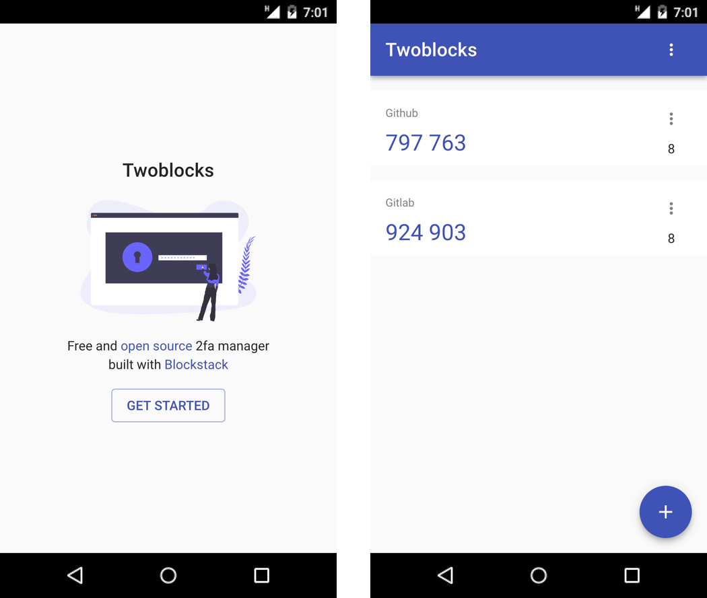

<h1 align="center">Twoblocks</h1>

<p align="center">
  
</p>

<p align="center">
  Free and open source 2fa manager built with Blockstack
</p>

<p align="center">
  
  
</p>

<p align="center">
  
</p>

## 🚀 Features

- Codes are synced between devices
- Use your phone / laptop camera to scan a qrcode
- Add an account manually
- Dark theme
- Data stored on the storage of your choice using Blockstack

## 📚 Setup

First you need to clone the repository:

```sh
git clone git@github.com:pradel/twoblocks.git
```

Then run the following command to install dependencies:

```sh
yarn install
```

Finally to start the server run:

```sh
yarn start
```

You can now open your browser and go to http://localhost:3000 to see the app.

## ☝️ Feature requests, suggest changes

Open an issue on this repo :)

## 📖 License

MIT © [Léo Pradel](https://www.leopradel.com/)
